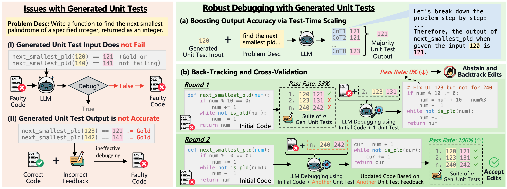

# [Learning to Generate Unit Tests for Automated Debugging]()
[Archiki Prasad](https://archiki.github.io/)\*, [Elias Stengel-Eskin](https://esteng.github.io/)\*, [Justin Chih-Yao Chen](https://dinobby.github.io/), [Zaid Khan](https://zaidkhan.me/), [Mohit Bansal](https://www.cs.unc.edu/~mbansal/)


## Overview
This repository contains the code for our paper [Learning to Generate Unit Tests for Automated Debugging](). We present UTGen, a data curation and training pipeline for training models for unit test generation, and UTDebug, a debugging pipeline that uses generated unit tests for automated code-debugging using LLMs. In this repo, we provide the code for UTDebug to evaluate unit tests extrinsically and a script to evaluate attack rate, output accuracy, and acc $\cap$ attack on three debugging datasets: HE+Fix, MBPP+Fix, and MBPP+Fix (Hard).



## Dependencies
This project is built on Python 3.10.11. All dependencies can be installed via:
```
pip install -r requirements.txt
```

## Scripts and Running UTDebug

### For Intrinsic Evaluation
- Run scripts `he_intrinsic_eval.py` for HE+Fix and `mbpp_intrinsic_eval.py` for MBPP+Fix and MBPP+Fix Hard. For the latter add the `--hard` argument. When evaluating off-the-shelf models, please pass the argument `--eval-base`, or otherwise provide a trained LoRA checkpoint dir via `--ckpt-dir`. For randomly-sampled UTs use the argument `--random`.

Example for evaluating trained Qwen2.5 on MBPP+Hard as done in the paper:
```
python mbpp_intrinsic_eval.py --model qwen --ckpt-dir <path to ckpt> --use-temp --num-units 3
```
Example for evaluating randomly-sampled UTs from Qwen2.5 on MBPP+Hard as done in the paper:
```
python mbpp_intrinsic_eval.py --model qwen --eval-base --random --use-temp --num-units 3
```

### For running UTDebug
The UT generation method is provided using the `--unit-mode` argument. Use `--unit-mode joint_sc` for the prompted failing UTs, `--unit-mode train_joint_sc` for UTGen or any trained models, and `--unit-mode random_joint_sc` for randomly-sampled UTs. Note that by default, round 0 evaluated the given erroneous code in the dataset, so set `--max-turns <number of debug rounds> + 1`

Example for running UTDebug with UTGen trained model on MBPP+Hard as done in the paper with 3 UTs and 3 turns:
```
python mbpp_utdebug.py --model qwen --ckpt-dir <path to ckpt> --units 3 --max-turns 4 --backtrack --unit-mode train_joint_sc --dataset mbpp_plus_fix_hard
```
The no UT feedback baseline is implemented in `no_ut_{he/mbpp}.py` files and only takes `--dataset`, `--model`, and `--max-turns` arguments.

## Reference
Please cite our paper as 
```
@article{prasad2025unit,
    title = {Learning to Generate Unit Tests for Automated Debugging},
    author = {Prasad, Archiki and Stengel-Eskin, Elias and Chen, Justin Chih-Yao and Khan, Zaid and Bansal, Mohit}, 
    year = {2025},
    journal={arXiv preprint 2502.} 
}
```
